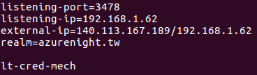
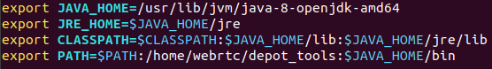

# 程式架構及環境設定
## Secure Phone App

### CallActivity.java
使用者在這個頁面選擇想要進行連線的方式，經過Server或是P2P這兩種，
也可以選擇要進行視訊或是影音通話，
選擇完連線方式之後輸入房間名稱或是對方的IP位址，
最後選擇是否要開啟擴音後，就可以撥出電話，
而畫面的左下角是手機端目前的IP位址。

### VideoActivity.java
負責管理WebRTC的物件以及管理UI的部分，
使用者會在這個頁面和其他使用者進行視訊。

### VideoSignalingClient.java
負責與其他人進行對話並且做出相對應的處理，
包含與Signaling Server對話以及與其他VideoSignalingClient對話的功能。

## Secure Phone Server

### VideoSignalingServer
「視訊通話」部分的Signaling Server，  
初次使用時，必須先執行`npm install`來安裝需要的套件，  
透過`node SignalingServer.js`來啟動Server，  
會listen在1794這個port。

### Coturn
在Ubuntu的環境中，  
初次使用時，  
必須先透過`apt install coturn`來安裝Coturn，  
並使用`turnadmin`來新增TURN Server的使用者，  
並設定TURN Server的設定檔，  
預設的路徑位於「/etc/turnserver.conf」，  
詳情請參考附圖。  

註：設定使用者和修改設定檔時，  必須確認**realm**的部分是相同的。

# 編譯WebRTC source code
可參考[此連結](https://webrtc.org/native-code/android/)，  詳細步驟說明如下：
1. 安裝Depot Tools
2. 透過`fetch --nohooks webrtc_android`取得原始碼
3. 透過`git checkout`，切換到對應的版本  
註：雛型系統中，使用的WebRTC版本號是「1.0.23430」，  
其對應的commit hash為「cd51375e0cd92c2b6740d1cf1b6e576cee7a5639」。
4. 執行`gclient sync`
5. 透過`./build/install-build-deps-android.sh`安裝編譯時必要的套件
6. 修改**.bashrc**以設定Java的環境變數，詳情請參考附圖

7. 透過`./tools_webrtc/android/build_aar.py`編譯出aar格式的library  
註：編譯完成後，library會位於根目錄底下，名為「libwebrtc.aar」。
8. 把編譯好的aar檔案放入專案的`app/libwebrtc`資料夾後，重新編譯專案就是使用新的library了